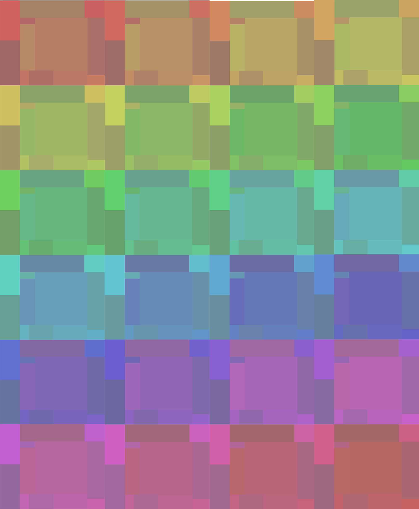
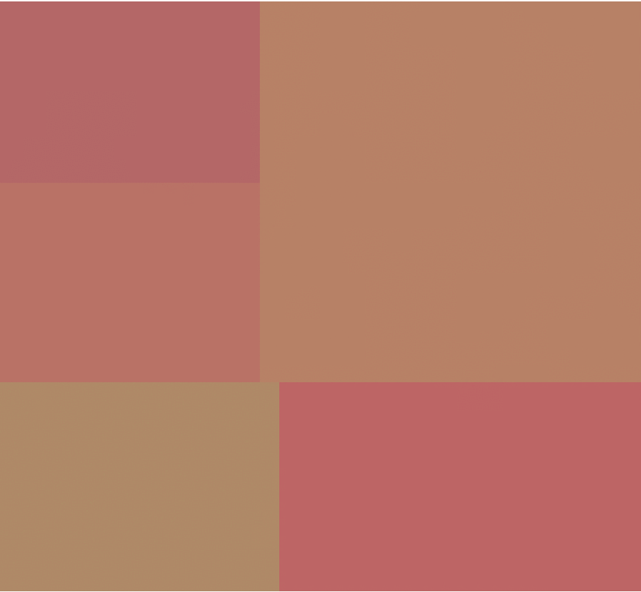
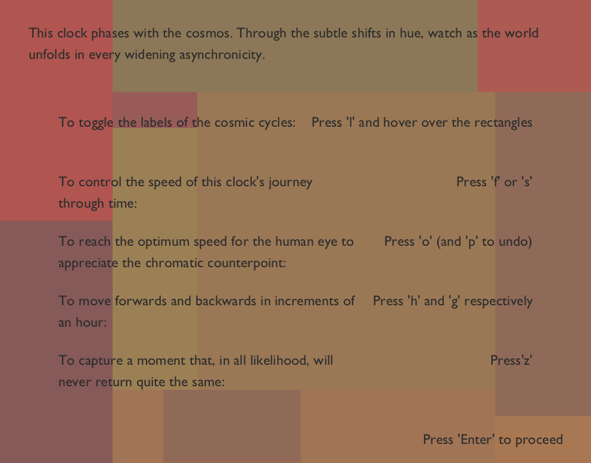

# CelestialClock
A quick conceptual design project. Prompt: Design a Clock, whatever that means for you.

My clock is a rectangle packing algorithm, which allows the user to define a number of cosmic cycles of their choice, along with their length in days. It then generates a packing in a manner such that the ratios of the areas of the rectangles are equal to the ratios of the lengths of the respective cycles. Therefore area becomes a dimension for representing the period of a cosmic cycle. Moreover, the packing algorithm is designed to create a radial structure in the clock.

The overall hue palette of the clock is defined by the time of day, cycling through the entire range over the course of 24 hours. Each individual rectangle is initialized to a random epsilon variation in brightness and saturation, with the range of epsilon increasing the further outward you move from the center. However, the central concept of the clock is about the subtle phasing of cosmic cycles, independent of the units we try to bind them in. To try and represent that, I took the cycle lengths of each event and, by artificially syncing them all at the turn of the millennium, I calculated their position in their cycle. In other words, I calculated the phase. All the cycles are represented in terms of days and are unfolding in real time. Since all of them were artificially synced at the year 2000(an arbitrary choice that the user can change), the data I get is not true astronomical data but rather a representation of cosmic phasing. I then take these cyclic motions and map them on to the rectangles by making the hues of the rectangles subtly oscillate to their cosmic frequency.

The clock also has some interactive features. When you open the Processing application, you get a screen like the one below, telling you the various features. On pressing enter, you begin experiencing the clock. If you press the letter ‘l’, you can find out the name of the representative cosmic cycle by hovering over a rectangle. Since the actual phasing of the clock is occurring in real time and is therefore imperceptibly slow, you can speed it up and slow it down by factors of 2 using ‘f’ and ‘s’. My intention for this design was to create a subtly undulating field of hues that vary in an almost subliminal manner. Therefore, the right choice of speed is extremely important. By pressing ‘o’, you get what I believe to be the optimal speed for the given packing. The gif above illustrates the clock at this speed.

A fundamental premise of this design was the separation of units from events, which is reflected in the design of the clock since the change in the speed of the cosmic cycles having no effect on the hue palette. This is solely linked to the time of day. However, by pressing ‘h’ and ‘g’ you can move forwards and backwards respectively through the hue palette of the clock in hourly increments. By pressing ‘z’, the current frame gets exported as a png. The image at the top is an arrangement of such frames taken of the clock at hourly increments, starting at midnight and going till 11pm. The first gif below is a visualization of cycle packings of increasing number. The second gif is a longer demonstration of the entire flow of interaction.

